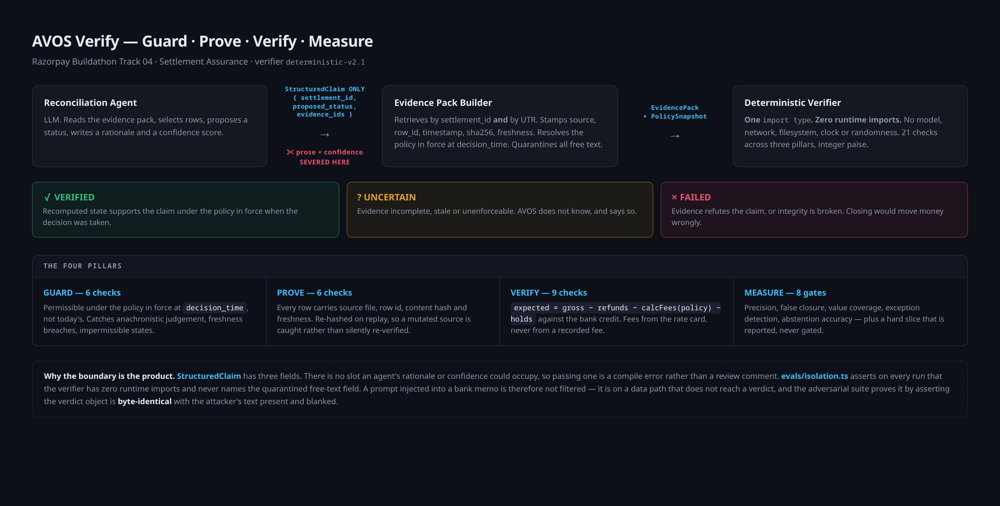

# AVOS Verify — architecture in one page



*Depth, rationale and the precedence table live in [`../ARCHITECTURE.md`](../ARCHITECTURE.md).
This page is the shape of the thing.*

---

## The workflow

```
  ┌──────────────────┐
  │ 1. AGENT         │  An LLM reads the evidence pack, picks the rows it thinks
  │    proposes      │  matter, proposes a status, and writes a confident sentence.
  └────────┬─────────┘
           │
           │   StructuredClaim { settlement_id, proposed_status, evidence_ids }
           │
           │   ✂  agent_reason and confidence are SEVERED here. Both are stored
           │      and displayed — struck through — beside the verdict. Neither
           │      has a field on VerifierInput it could occupy, so passing one
           │      is a compile error rather than a code review comment.
           ▼
  ┌──────────────────┐
  │ 2. EVIDENCE PACK │  Retrieve by settlement_id AND by UTR. Stamp every row
  │    is built      │  with source file, row_id, timestamp, sha256 content hash
  └────────┬─────────┘  and freshness. Resolve the policy in force at
           │            decision_time. Quarantine all free text.
           ▼
  ┌──────────────────┐
  │ 3. VERIFIER      │  Pure function. One `import type`, zero runtime imports.
  │    recomputes    │  No model, network, filesystem, clock or randomness.
  └────────┬─────────┘  21 checks. Integer paise throughout.
           │
           │   expected = gross − refunds − calcFees(policy) − holds
           │   observed = bank credit
           │   difference = expected − observed
           ▼
  ┌──────────────────────────────────────────────────────┐
  │ 4. VERDICT   VERIFIED · UNCERTAIN · FAILED           │
  │              + reason code + full check ledger        │
  └────────┬─────────────────────────────────────────────┘
           ▼
  ┌──────────────────┐
  │ 5. PROOF CARD    │  Agent claim beside AVOS verdict. Expected / observed /
  │                  │  difference. Every evidence row clickable to its source
  └────────┬─────────┘  file, row locator, full hash, and the checks that read it.
           ▼
  ┌──────────────────┐
  │ 6. REPLAY        │  Re-evaluate under a different policy epoch, or with a
  │                  │  source row perturbed. Same evidence, dated rules.
  └──────────────────┘
```

---

## The four pillars

| Pillar | Checks | What it answers |
|---|---|---|
| **Guard** | 6 | Is closure permissible under the policy that was in force **at `decision_time`** — not today's? |
| **Prove** | 6 | Is the evidence complete, unchanged since it was recorded, and did it exist when the decision was taken? |
| **Verify** | 9 | Does the money actually reconcile, recomputed from the rate card rather than from any recorded fee? |
| **Measure** | 8 gates | Precision, false closure, value coverage, exception detection, abstention accuracy — plus a hard slice that is reported and never gated. |

### Guard
`claim_binds_to_pack` · `policy_in_force` · `policy_epoch_matches_decision` ·
`agent_citation_coverage` · `evidence_fresh` · `closure_permitted_by_policy`

Policy is a function of a timestamp, never a constant. `resolvePolicy(at)` is the
only way any layer obtains a tolerance, and it returns `null` rather than a
permissive default when the instant predates every snapshot.

### Prove
`evidence_well_formed` · `evidence_reproducible` · `evidence_available_at_decision_time` ·
`payments_predate_settlement_cut` · `evidence_complete` · `evidence_predates_decision`

Content hashes exclude `row_id`, so a file ingested twice produces two rows that
**collide** — and that collision is the duplicate-file detector.

### Verify
`payment_ids_unique` · `refunds_within_their_payments` · `webhook_idempotent` ·
`no_duplicate_ingestion` · `utr_unique` · `sources_agree` · `temporal_consistency` ·
`arithmetic_reconciles` · `recorded_fees_match_rate_card`

Fees come from the policy rate card. A mispricing bug that wrote the same wrong
fee to the settlement *and* its payment rows makes them agree perfectly, and a
verifier comparing them to each other passes it.

### Measure
`npm run eval` exits non-zero on any of 8 gates. The hard slice is deliberately
**not** among them — a gate creates pressure to tune it green, which is the
failure it exists to expose.

---

## The verdicts

| | Meaning |
|---|---|
| **VERIFIED** | The recomputed state supports the claim, under the policy in force when the decision was taken. |
| **UNCERTAIN** | Evidence is incomplete, stale or unenforceable. AVOS does not know, and says so. |
| **FAILED** | Evidence refutes the claim, or its integrity is broken such that closing would move money incorrectly. |

**An UNCERTAIN is not a failure of the system. A wrong VERIFIED is.** That
asymmetry is the entire reason false-closure rate can be 0%: when AVOS cannot
prove it, it does not close it.

---

## Where AI is, and is not

| Used for | Never used for |
|---|---|
| Selecting which evidence to cite | Arithmetic, totals, fee calculation |
| Turning findings into an operator note + routing | UTR matching, ledger state |
| Answering questions with citations | Policy enforcement |
| | **The verdict** |

The right column is not enforced by discipline. None of those paths can reach a
model, because `lib/verifier/deterministic.ts` has zero runtime imports and
`npm run check:isolation` fails the build if that stops being true.
